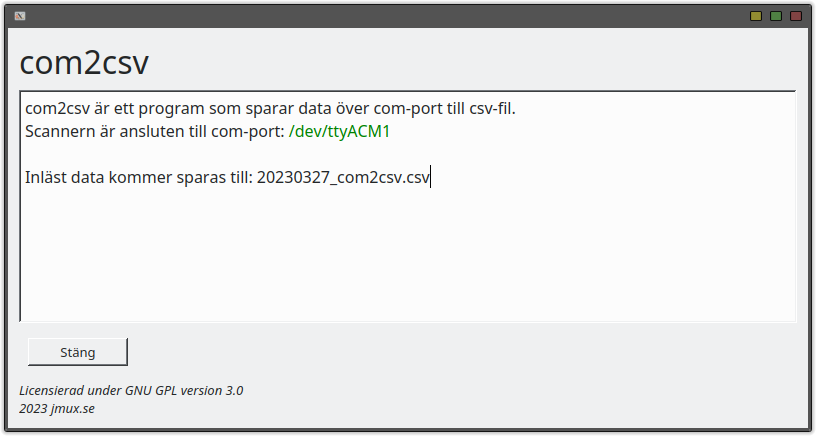

# com2csv

## Description

A GUI application for reading data from a barcode scanner and saving it to a CSV file.
Description:
This application connects to a barcode scanner via a serial port and listens for incoming data. All read data is saved to a CSV file along with the time the data was read. If the same data is read multiple times, only one copy is written to the file.

The application has a simple GUI with a text box to display read data and two buttons: "Close" to exit the application and "Delete data" to clear all previously saved data.

## Installation
Run com2csv.py OR install exe on Windows.

## Configuration
The program automatically identifies the barcode scanner based on the device description, which typically contains the words "barcode" or "scanner".
The CSV-file will be created in same directory as com2csv.py file.
