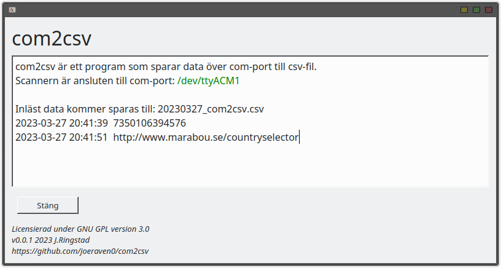

# com2csv

[com2csv.exe download package v0.0.1](https://github.com/joeraven0/com2csv/releases/tag/v0.0.1)

## Description

A GUI application for reading data from a barcode scanner and saving it to a CSV file.

This application connects to a barcode scanner via a serial port (physical or emulated) and listens for incoming data. All read data is saved to a CSV file along with the time the data was read. If the same data is read multiple times, only one copy is written to the file.

The application has a simple GUI with a text box to display read data and one button: "Close" to exit the application.

## Installation
Run com2csv.py OR install exe on Windows.

## Configuration
The program automatically identifies the barcode scanner based on the device description, which must contain "barcode", "scanner" or "serial device". No manual com-port selection available. com2csv.py file must be changed manually.
The CSV-file will be created in same directory as com2csv.py file.
Suffix (last character of transmitted string) must be configured in scanner to be CR (0x0D or '\r'). This is default configuration for most scanners.

## Compatible scanners
Device information is confirmed to work with Datalogic Gryphon, but other brands are compatible.
